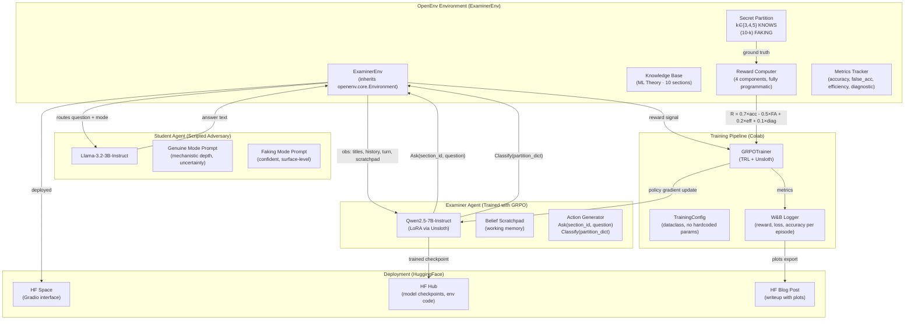
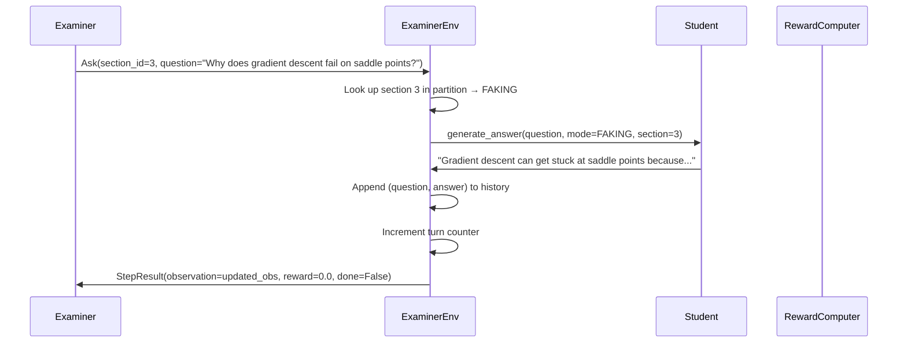
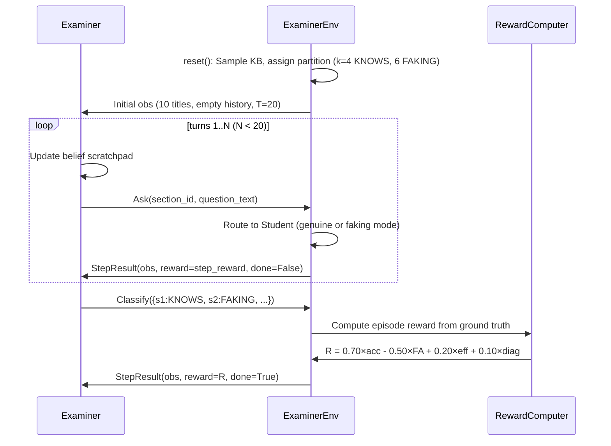
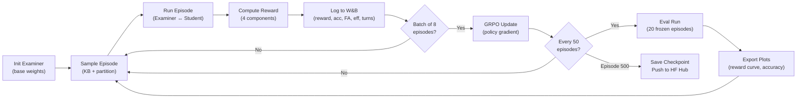
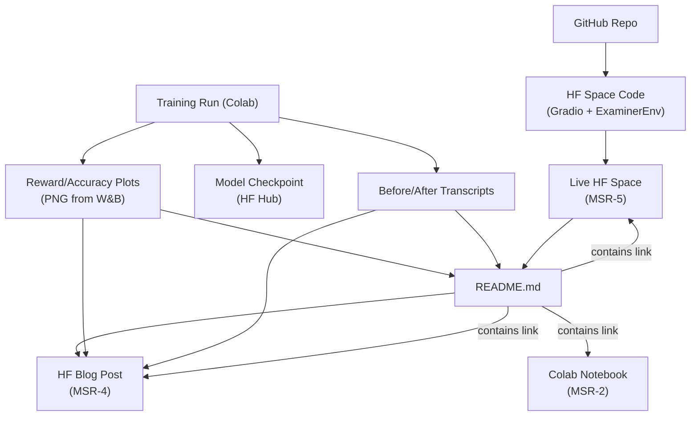

# 🏗️ ARCHITECTURE.md — THE EXAMINER
## Complete System Architecture · OpenEnv Hackathon India 2026

---

# 1. System Architecture Diagram



---

# 2. Data Flow Diagrams

## 2.1 Single Environment Step



## 2.2 Full Training Episode



## 2.3 Complete Training Run with Logging



## 2.4 Submission Artifact Pipeline



---

# 3. Tech Stack Table

| Component | Technology | Version | Justification | AI-Friendliness | MSR |
|---|---|---|---|---|---|
| Environment Framework | `openenv-core` | latest (pip) | Required by hackathon | ⭐⭐⭐⭐ Good docs, Gymnasium-style | MSR-1 |
| RL Algorithm | GRPO via `trl.GRPOTrainer` | `trl>=0.15` | Same as DeepSeek-R1; well-supported in TRL | ⭐⭐⭐⭐ Proven pattern | MSR-2 |
| Model Optimization | Unsloth `FastLanguageModel` | `unsloth>=2025.4` | 90% VRAM reduction, required by hackathon | ⭐⭐⭐⭐⭐ Excellent Colab support | MSR-2 |
| Examiner Model | Qwen2.5-7B-Instruct | HF latest | Strong instruction following, fits A100 | ⭐⭐⭐⭐ Well-known to AI tools | MSR-2 |
| Student Model | Llama-3.2-3B-Instruct | HF latest | Small enough to run alongside Examiner | ⭐⭐⭐⭐⭐ | — |
| Logging | Weights & Biases | `wandb>=0.19` | Industry standard, easy plot export | ⭐⭐⭐⭐⭐ | MSR-3 |
| Deployment UI | Gradio | `gradio>=5.0` | Native HF Space support | ⭐⭐⭐⭐ | MSR-5 |
| Model Hosting | HuggingFace Hub | `huggingface_hub>=0.27` | Required by hackathon | ⭐⭐⭐⭐ Verify API versions! | MSR-5 |
| Notebook | Google Colab | — | Judges can re-run; free GPU | ⭐⭐⭐⭐⭐ | MSR-2 |
| Serialization | Pydantic v2 | via openenv | Type-safe Action/Observation | ⭐⭐⭐⭐ | MSR-1 |
| Python | CPython | 3.10+ | Colab default | ⭐⭐⭐⭐⭐ | — |

---

# 4. OpenEnv Integration Notes

## Base Classes to Inherit

```python
from openenv.core import Environment  # Server-side base class

# Our environment inherits from this:
class ExaminerEnvironment(Environment):
    """Server-side environment logic."""
    
    async def reset(self) -> ExaminerObservation:
        """Initialize new episode. Sample KB, assign partition."""
        ...
    
    async def step(self, action: ExaminerAction) -> StepResult:
        """Process Ask or Classify action. Returns StepResult."""
        ...
    
    async def state(self) -> ExaminerState:
        """Return episode metadata."""
        ...
```

## Methods Overridden
| Method | What We Implement |
|---|---|
| `reset()` | Sample knowledge base, assign partition, return initial observation |
| `step(action)` | Route Ask to Student, process Classify, compute reward |
| `state()` | Return episode_id, step_count, current turn |

## Methods Extended (call `super()` first)
- None — OpenEnv's base `reset()` handles seeding; we call `super().reset()` then add our logic

## Methods NOT Touched
- WebSocket/HTTP server infrastructure (`create_app`, `env_server`)
- Container/Docker management
- Client-side `EnvClient` base (we subclass it for our client)

## ⚠️ OpenEnv API Patterns AI Gets Wrong
1. **Sync vs Async:** OpenEnv is async-first. AI will generate `def step()` instead of `async def step()`. Always use `async`.
2. **StepResult structure:** It's `StepResult(observation=..., reward=..., done=..., truncated=..., info=...)`. AI may use old Gymnasium tuple `(obs, reward, done, info)`.
3. **Action/Observation as dataclasses:** Must be Pydantic `BaseModel` or dataclass, not plain dicts.
4. **`openenv init` scaffold:** Use this to generate boilerplate, don't hand-write the server structure.

---

# 5. Training Pipeline Architecture

## Model Configuration
```python
from dataclasses import dataclass

@dataclass
class TrainingConfig:
    # Model
    examiner_model: str = "Qwen/Qwen2.5-7B-Instruct"
    student_model: str = "meta-llama/Llama-3.2-3B-Instruct"
    
    # LoRA
    lora_r: int = 16
    lora_alpha: int = 32
    lora_dropout: float = 0.05
    
    # GRPO
    num_generations: int = 4          # completions per prompt
    max_steps: int = 500              # training steps
    batch_size: int = 8               # episodes per batch
    learning_rate: float = 5e-6
    kl_penalty: float = 0.01          # prevent policy collapse
    
    # Environment
    kb_domain: str = "ml_theory"
    kb_sections: int = 10
    max_turns: int = 20
    
    # Logging
    wandb_project: str = "the-examiner"
    log_every_n_episodes: int = 1
    eval_every_n_episodes: int = 50
    eval_episodes: int = 20
    
    # Checkpointing
    save_every_n_episodes: int = 100
    hf_hub_repo: str = "team/the-examiner"
    
    # Step reward (disabled after 200 episodes)
    use_step_reward: bool = True
    step_reward_weight: float = 0.05
    step_reward_disable_after: int = 200
```

## Reward Function Placement
The reward function lives in `examiner_env/reward.py`. It is called by `ExaminerEnvironment.step()` when a `Classify` action is received. It receives:
- `predicted_partition: dict[int, str]` — Examiner's classification
- `true_partition: dict[int, str]` — ground truth
- `turns_used: int` — how many turns were consumed
- `question_history: list[dict]` — all questions asked and answers received
- `genuine_baselines: dict[int, str]` — pre-computed genuine-mode answers for diagnostic quality

## Reward Function Pseudocode (SOURCE OF TRUTH — implement exactly this)
```
function compute_reward(predicted, true, turns_used, max_turns, question_history, genuine_baselines):
    
    # Component 1: Classification accuracy (weight: 0.70)
    correct = 0
    false_accusations = 0
    for each section i in 1..10:
        if predicted[i] == true[i]:
            correct += 1
        elif predicted[i] == FAKING and true[i] == KNOWS:
            false_accusations += 1
            correct -= 1  # penalize in accuracy too
    accuracy_score = correct / 10  # normalized to [-1, 1] range
    
    # Component 2: False accusation penalty (weight: -0.50 per error)
    fa_penalty = false_accusations * 0.5
    
    # Component 3: Efficiency bonus (weight: 0.20)
    efficiency_bonus = (max_turns - turns_used) / max_turns * 0.20
    
    # Component 4: Diagnostic quality bonus (weight: 0.10)
    diagnostic_score = 0
    faking_sections_asked = sections where true[i] == FAKING AND at least one question was asked
    for each such section:
        # Compare student's faking answer to genuine baseline
        # Higher divergence = better diagnostic question
        divergence = compute_answer_divergence(faking_answer, genuine_baseline)
        diagnostic_score += divergence
    diagnostic_score = normalize(diagnostic_score) * 0.10
    
    # Final reward
    R = 0.70 * accuracy_score - fa_penalty + efficiency_bonus + diagnostic_score
    return R
```

---

# 6. Logging and Plotting Architecture

## What is Logged
| Metric | When | Format | Destination |
|---|---|---|---|
| Episode reward (total) | End of each episode | float | W&B |
| Classification accuracy | End of each episode | float [0,1] | W&B |
| False accusation count | End of each episode | int | W&B |
| Efficiency score | End of each episode | float [0,1] | W&B |
| Diagnostic quality score | End of each episode | float [0,1] | W&B |
| Mean turns to classify | End of each episode | float | W&B |
| Training loss | Each gradient step | float | W&B |
| KL divergence | Each gradient step | float | W&B |
| Question type distribution | Every 50 episodes (eval) | dict | W&B |
| Full episode transcript | Every 50 episodes (eval) | text | W&B artifacts |

## How Plots Are Generated
1. Training runs log to W&B in real-time
2. At end of training: `wandb.Api().run("team/the-examiner/run_id").history()` → pandas DataFrame
3. Plot script (`scripts/generate_plots.py`) exports:
   - `outputs/plots/reward_curve.png` — episodes vs. mean reward (smoothed)
   - `outputs/plots/accuracy_curve.png` — episodes vs. classification accuracy
   - `outputs/plots/question_types.png` — bar chart of question type distribution at episode 10 vs 400
4. These PNGs are embedded in README and blog post

---

# 7. HuggingFace Space Architecture

## What Runs in the Space
- Gradio `Blocks` app with the following interface:
  1. **Episode Runner tab:** Select domain, click "Run Episode", watch Examiner question a Student in real-time
  2. **Training Results tab:** Display reward curve plot, accuracy plot, before/after transcripts
  3. **About tab:** 3-sentence narrative, architecture diagram, team info

## What the Judge Sees
1. Opens HF Space URL → Gradio loads
2. Clicks "Run Episode" → sees live transcript of Examiner asking questions and Student answering
3. Sees the Examiner's final classification vs. ground truth
4. Switches to Results tab → sees reward curve and side-by-side transcripts
5. Understands the full story in under 60 seconds

## Space Structure
```
hf_space/
├── app.py              # Gradio Blocks app (C2 owns)
├── requirements.txt    # Dependencies for Space
├── README.md           # HF Space card (contains 3-sentence narrative)
└── assets/
    ├── reward_curve.png
    ├── accuracy_curve.png
    └── architecture.png
```

---

# 8. Storytelling Artifacts Architecture

| Artifact | Source | Tool | Owner | Linked In |
|---|---|---|---|---|
| README.md | Written during Phase 4-5 | Markdown | ALL (VAL finalizes) | GitHub repo root |
| HF Blog Post | Written during Phase 5 | HF blog editor | VAL | README (MSR-8) |
| Demo Video (<2 min) | Recorded during Phase 5 | Screen recorder → YouTube | VAL | README (MSR-8) |
| Reward Curve Plot | Generated from W&B data | `scripts/generate_plots.py` | C2 | README, Blog, HF Space |
| Before/After Transcripts | Selected from training logs | Manual selection | VAL | README, Blog, HF Space |

---

# 9. Per-Component Vibe Coding Notes

## ExaminerEnvironment (C1)
- **Scaffold prompt:** "Implement an OpenEnv Environment subclass called ExaminerEnvironment. It inherits from `openenv.core.Environment`. Implements `async def reset()`, `async def step(action)`, `async def state()`. [Paste OpenEnv Environment base class interface here]."
- **Common AI mistakes:** Generating sync methods, using dict instead of Pydantic models, reimplementing OpenEnv server code
- **Post-generation verification:** Does it inherit from `Environment`? Are methods async? Does `step()` return `StepResult`?
- **Token-efficient context:** Paste only `Environment` base class + `Action`/`Observation`/`StepResult` definitions

## Reward Function (C1)
- **Scaffold prompt:** "Implement the reward function exactly matching this pseudocode: [paste pseudocode from Section 5]. Input types: predicted: dict[int, str], true: dict[int, str], turns_used: int, max_turns: int, question_history: list, genuine_baselines: dict. Returns float."
- **Common AI mistakes:** Inventing extra reward components, using LLM-as-judge, returning constant values
- **Post-generation verification:** Test with hand-crafted inputs. All-FAKING prediction → negative reward? Perfect prediction → positive reward?

## Training Script (C2)
- **Scaffold prompt:** "Create a GRPO training script using Unsloth FastLanguageModel and TRL GRPOTrainer. Model: Qwen2.5-7B-Instruct. Config: [paste TrainingConfig]. The training loop runs episodes against ExaminerEnv, collects rewards, logs to W&B."
- **Common AI mistakes:** Custom training loop (bypasses TRL), local file paths in Colab, deprecated HF API calls
- **Post-generation verification:** Does it use `GRPOTrainer`? Does it log to W&B? Does it run in Colab?

## Gradio Space (C2)
- **Scaffold prompt:** "Create a Gradio Blocks app for HuggingFace Spaces. Two tabs: Episode Runner (runs ExaminerEnv episode with trained model) and Results (shows reward curve plot, before/after transcripts)."
- **Common AI mistakes:** Using `gr.Interface` instead of `gr.Blocks`, hardcoded local paths, missing error handling
- **Post-generation verification:** Does it deploy to HF Spaces? Is it publicly accessible in incognito?

---

# 10. Folder/File Structure Tree

```
the-examiner/
├── README.md                          # C: ALL (VAL finalizes) | MSR-6,7,8 | STORYTELLING
├── guardrails.md                      # C: ALL | All MSRs | ALL CRITERIA
├── architecture.md                    # C: ALL | Reference doc
├── mistakes.md                        # C: ALL | Living error log
├── context_primer.md                  # C: ALL | AI session primer
├── submission_checklist.md            # C: VAL | Final validation
├── .gitignore                         # C: SHARED
├── .env.example                       # C: SHARED | Config template
│
├── examiner_env/                      # C1 OWNS (except client.py → C2)
│   ├── __init__.py                    # C: C1 | MSR-1
│   ├── models.py                      # C: C1 | MSR-1 | Action/Observation/State dataclasses
│   ├── reward.py                      # C: C1 | PIPELINE | Reward function (4 components)
│   ├── knowledge_base.py             # C: C1 | ENV_INNOV | ML theory KB (10 sections)
│   ├── student.py                     # C: C1 | ENV_INNOV | Student agent (genuine/faking)
│   ├── client.py                      # C: C2 | MSR-1 | EnvClient subclass
│   ├── openenv.yaml                   # C: C1 | MSR-1 | Environment manifest
│   ├── pyproject.toml                 # C: C1 | Dependencies
│   └── server/
│       ├── examiner_environment.py    # C: C1 | MSR-1 | Environment(Environment) subclass
│       ├── app.py                     # C: C1 | MSR-1 | FastAPI server
│       ├── requirements.txt           # C: C1 | Docker deps
│       └── Dockerfile                 # C: C1 | Container
│
├── training/                          # C2 OWNS
│   ├── config.py                      # C: C2 | MSR-2 | TrainingConfig dataclass
│   ├── train_grpo.py                  # C: C2 | MSR-2 | GRPO training script
│   ├── train_colab.ipynb              # C: C2 | MSR-2 | Colab notebook (runnable top-to-bottom)
│   └── eval.py                        # C: C2 | MSR-3 | Evaluation + transcript selection
│
├── scripts/                           # C2 OWNS
│   ├── generate_plots.py             # C: C2 | MSR-3 | W&B → PNG plots
│   ├── select_transcripts.py         # C: C2 | STORYTELLING | Before/after transcript selector
│   └── push_to_hub.py                # C: C2 | MSR-5 | HF Hub push utility
│
├── hf_space/                          # C2 OWNS
│   ├── app.py                         # C: C2 | MSR-5 | Gradio Blocks app
│   ├── requirements.txt               # C: C2 | MSR-5
│   ├── README.md                      # C: C2 | MSR-5 | Space card
│   └── assets/                        # C: C2 | STORYTELLING
│       ├── reward_curve.png
│       ├── accuracy_curve.png
│       └── architecture.png
│
├── outputs/                           # GENERATED (gitignored except plots/)
│   ├── plots/                         # C: C2 | MSR-3 | Committed to repo
│   │   ├── reward_curve.png
│   │   ├── accuracy_curve.png
│   │   └── question_types.png
│   ├── transcripts/                   # C: C2 | STORYTELLING | Committed
│   │   ├── before.txt
│   │   └── after.txt
│   ├── checkpoints/                   # gitignored (pushed to HF Hub)
│   └── logs/                          # gitignored (in W&B)
│
├── tests/                             # VAL OWNS
│   ├── test_reward.py                 # C: VAL | PIPELINE | Reward function unit tests
│   ├── test_environment.py            # C: VAL | MSR-1 | OpenEnv compliance tests
│   └── test_episode.py               # C: VAL | ENV_INNOV | Full episode smoke test
│
└── _quarantine/                       # Quarantined AI-generated code (never committed)
```

---

# 11. Environment Variables and Config

| Variable | Description | Example | Required |
|---|---|---|---|
| `WANDB_API_KEY` | W&B authentication | `wandb_abc123...` | ✅ for training |
| `HF_TOKEN` | HuggingFace Hub write access | `hf_abc123...` | ✅ for deployment |
| `OPENAI_API_KEY` | NOT USED — we don't use OpenAI | — | ❌ |
| `EXAMINER_MODEL` | Examiner model HF ID | `Qwen/Qwen2.5-7B-Instruct` | ✅ |
| `STUDENT_MODEL` | Student model HF ID | `meta-llama/Llama-3.2-3B-Instruct` | ✅ |
| `KB_DOMAIN` | Knowledge base domain | `ml_theory` | ✅ |
| `MAX_TURNS` | Max turns per episode | `20` | ✅ |
| `ENABLE_WEB_INTERFACE` | OpenEnv web debug UI | `false` | ❌ |

---

# 12. ⚠️ Warning Labels — HuggingFace API Patterns AI Gets Wrong

1. **`model.push_to_hub()`** — Unsloth models use `model.save_pretrained_merged()` then `push_to_hub()`. AI will use the wrong save method.
2. **`GRPOTrainer` constructor** — The `reward_model` param is NOT a model. It's a reward function callable. AI will try to pass a model.
3. **`GRPOConfig.num_generations`** — This controls how many completions per prompt GRPO generates. AI may confuse it with `num_train_epochs`.
4. **HF Space `README.md` frontmatter** — Must include `sdk: gradio` and `sdk_version: 5.x`. AI generates `sdk: streamlit` or omits version.
5. **`openenv` import paths** — It's `from openenv.core import Environment`, NOT `from openenv import Environment`. AI gets the import path wrong.
6. **Async context managers** — OpenEnv clients use `async with EnvClient() as client:`. AI generates `client = EnvClient()` without context manager.
