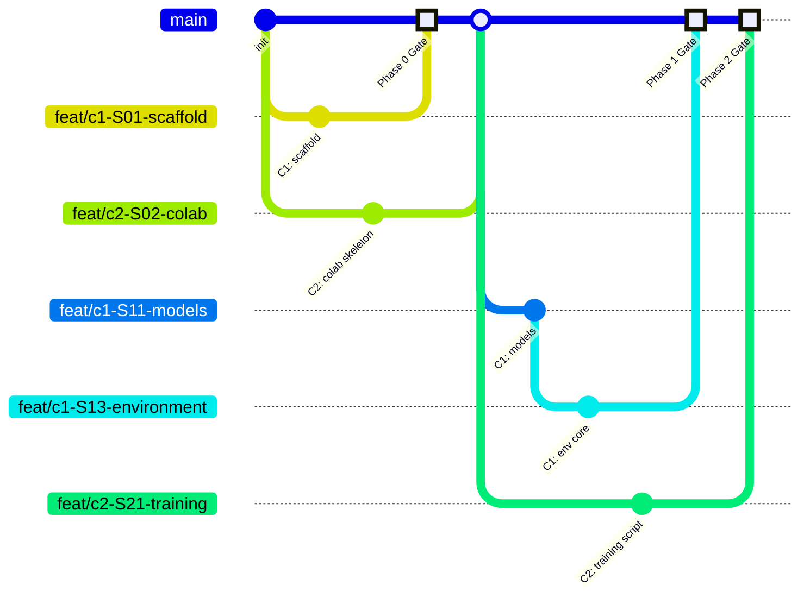

# 🔀 MERGE PROCEDURE — THE EXAMINER
## Zero-Ambiguity Git Collaboration Protocol

---

# Branch Map



## Branch Naming Convention
| Branch | Format | Example |
|---|---|---|
| Coder 1 feature | `feat/c1-S[stage]-[feature]` | `feat/c1-S13-environment` |
| Coder 2 feature | `feat/c2-S[stage]-[feature]` | `feat/c2-S21-training` |
| Validator review | `validate/phase-[n]` | `validate/phase-1` |
| Main | `main` | Protected. Always deployable. |

---

# Merge Gate Schedule

| Gate | Trigger | MSRs Verified | C1 Merges | C2 Merges |
|---|---|---|---|---|
| Phase 0 | S0.1 + S0.2 + S0.3 done | MSR-1 (partial), MSR-2 (partial) | scaffold, KB | Colab skeleton |
| Phase 1 | S1.5 passes | MSR-1 ✅ | models, student, env, reward | — |
| Phase 2 | S2.4 passes | MSR-2 ✅ | — | training script, Colab |
| Phase 3 | S3.2 + S3.3 done | MSR-3 ✅ | adaptive difficulty | plots, transcripts |
| Phase 4 | S4.1 + S4.2 + S4.3 done | MSR-5,6,7,9 ✅ | — | HF Space, README |
| Phase 5 | S5.1 + S5.2 done | MSR-4,8 ✅ | — | blog links |
| Phase 6 (Final) | All MSRs ✅ | ALL | — | — |

---

# Complete Merge Procedure (10 Steps)

```
Step 1:  Coder pushes feature branch and posts HANDOFF message
Step 2:  Validator pulls feature branch locally
Step 3:  Validator runs sanity checks (from implementation file)
Step 4:  Validator runs MSR gate check for this phase
Step 5:  Validator runs AI code review (paste code + review prompt)
Step 6:  If PASS → Validator approves. If FAIL → Validator returns to Coder with fix list
Step 7:  Coder fixes issues (if any), pushes updated branch
Step 8:  Validator re-runs checks on updated branch
Step 9:  Validator merges to main: git checkout main && git merge --no-ff feat/[branch]
Step 10: Validator tags: git tag phase-[n]-gate && git push origin main --tags
```

---

# Commit Message Format

```
[type] C1|C2|VAL | stage-[id] | [feature] | [AI tool] | MSR:[n,n] | [passes/fails sanity]
```

**Types:** `feat`, `fix`, `integrate`, `validate`, `docs`, `config`, `train`, `deploy`

**Examples:**
```
[feat] C1 | stage-13 | core environment class | Claude | MSR:1 | passes sanity
[feat] C2 | stage-21 | GRPO training script | Cursor | MSR:2 | passes sanity
[validate] VAL | stage-15 | episode smoke test | Claude | MSR:1 | passes sanity
[fix] C1 | stage-14 | reward false accusation calc | Claude | MSR:3 | passes sanity
[docs] VAL | stage-42 | README final links | Manual | MSR:6,7,8 | passes sanity
[deploy] C2 | stage-41 | HF Space live | Cursor | MSR:5 | passes sanity
```

---

# Pull Procedure

## Start of Session
```bash
git checkout main
git pull origin main
git checkout -b feat/[role]-S[stage]-[feature]
```

## During Work (commit often)
```bash
git add [changed files only — no git add .]
git commit -m "[type] [role] | stage-[id] | [feature] | [tool] | MSR:[n] | [sanity]"
```

## Ready for Gate
```bash
git push origin feat/[role]-S[stage]-[feature]
# Post HANDOFF message to team
```

## After Gate Approval (Validator Only)
```bash
git checkout main
git pull origin main
git merge --no-ff feat/[branch] -m "[integrate] VAL | phase-[n]-gate | merge [branch] | MSR:[closed MSRs]"
git tag phase-[n]-gate
git push origin main --tags
```

---

# Shared Files Protocol

## Files with Shared Ownership
| File | Primary Owner | Can Edit | Change Request |
|---|---|---|---|
| `README.md` | VAL (final) | ALL | Anyone can PR, VAL approves |
| `guardrails.md` | ALL | ALL | Requires all 3 acknowledgments |
| `mistakes.md` | ALL | ALL | Anyone appends, no approval needed |
| `context_primer.md` | VAL | VAL only | VAL updates after phase changes |

## Change Request Format (for shared files)
```
CHANGE REQUEST | [file] | [requester]
Section: [which section]
Change: [what to change]
Reason: [why]
MSR impact: [which MSRs affected or NONE]
```

---

# HuggingFace-Specific Sync Rules

| Action | Owner | When | Procedure |
|---|---|---|---|
| Push code to HF Space | C2 | After Phase 4 gate | `huggingface-cli upload [space-id] hf_space/ .` |
| Push model to HF Hub | C2 | After Phase 3 training | `model.push_to_hub("team/the-examiner")` |
| Update Space README | C2 | After Phase 5 | Direct edit on HF |
| Verify Space is live | VAL | Every gate from Phase 4+ | Open in incognito |

**Rules:**
- HF Space pushes are **separate from GitHub commits** — always push to GitHub first, then to HF
- Never push broken code to HF Space — must pass Validator gate first (MSR-5)
- Only C2 pushes to HF Space/Hub — no exceptions
- After any HF push, VAL verifies in incognito within 15 min

---

# Vibe Drift Containment

If AI generates code outside the coder's owned files:
1. **DO NOT COMMIT** the out-of-scope code
2. Move it to `_quarantine/[timestamp]-[description].py`
3. Notify the file's actual owner
4. Restart the prompt with tighter scope: "Only modify [specific file]. Do not create or modify any other files."
5. Log in `mistakes.md` under OWNERSHIP_VIOLATION

---

# Conflict Resolution Protocol

If two branches modify the same area (shouldn't happen with strict ownership):

**AI Conflict Resolution Prompt:**
```
I have a Git merge conflict in [filename]. The file is owned by [C1/C2].

Version A (from [branch-a]):
[paste conflict section]

Version B (from [branch-b]):
[paste conflict section]

The file owner is [owner]. Their version takes priority unless it breaks an MSR.
MSRs this file serves: [list]

Resolve the conflict preserving the owner's intent. If the non-owner's changes are needed, incorporate them without breaking the owner's logic.
```

---

# What to NEVER Do

- ❌ Commit directly to `main` — always use feature branches
- ❌ Force push (`git push -f`) — ever, under any circumstances
- ❌ `git add .` — always specify exact files
- ❌ Merge without Validator gate clearance
- ❌ Push to HF Space without passing gate (MSR-5 risk)
- ❌ Edit files you don't own without a change request
- ❌ Commit `_quarantine/` contents
- ❌ Commit `.env` file (only `.env.example`)
- ❌ Commit `outputs/checkpoints/` or `outputs/logs/` (gitignored)
- ❌ Commit notebook outputs/checkpoints (clear outputs before commit)
